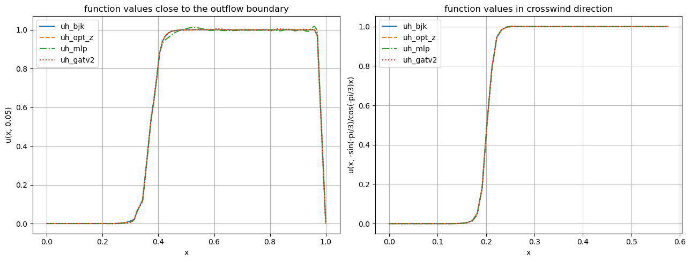

# SUPG-ML

`supgml` is the readable, installable form of the reusable numerical and
machine-learning code developed for the thesis on learning SUPG parameters for
singularly perturbed convection–diffusion problems.

## Start here

The repository is best read as a short scientific workflow, not as a collection
of unrelated notebooks:

1. **[Define and stabilize a PDE](tutorials/supg.md).** Notebook 01 shows the
   mesh, finite-element spaces, weak form, cellwise SUPG parameter, objective,
   and discrete adjoint.
2. **[Create graph learning cases](tutorials/graphs.md).** Notebook 02 maps FEM
   cells and fields to a documented graph schema, with optimized cellwise
   parameters as targets.
3. **[Compare the thesis models](tutorials/learning.md).** Notebooks 03–05
   compare MLP, GCN, GraphSAGE, GAT, and GATv2 using supervised and
   adjoint-backed objectives.
4. **[Read the results and research path](results.md).** This concise account
   restores the experimental findings and negative results preserved by the
   submitted notebooks.
5. **[Follow the Chapter 5 revision](tutorials/revised-study.md).**
   Notebooks 06–09 introduce the AFC-BJK reference, revised models,
   target-ambiguity analysis, and deterministic figure rendering.

### Read the notebooks in a browser

For Safari, start with the [rendered notebook collection](rendered-notebooks.md).
It links to the HTML export of every canonical notebook and requires neither a
Jupyter kernel nor a Python installation. The `.ipynb` files are the editable,
executable sources; the HTML pages are the browser-reading version.

The [canonical notebook map](notebooks.md) explains their thesis roles, and
`notebooks/README.md` records the execution order.

## A representative Chapter 5 comparison

The Chapter 5 AFC-BJK workflow compares its reference with optimized and
model-predicted SUPG solutions along outflow and crosswind line cuts. The close
agreement visible below motivates the revised study, while notebook 08 provides
the necessary qualification about target ambiguity and residual artefacts.



*Historical thesis figure export, retained as an archived artefact. It is shown
for orientation and is not a new result produced by this refactoring.*

## What belongs where

The notebooks retain the scientific choices: SPDE definitions, boundary data,
weak forms, objectives, experiment matrices, and interpretation. The `supgml`
package contains the mechanics that would otherwise be copied between
experiments: DOLFINx assembly and solves, the discrete-adjoint implementation,
the PyTorch/FEniCSx autograd bridge, graph serialization, model factories,
training loops, and visualisation helpers.

This boundary makes a result inspectable without making every notebook a copy
of numerical infrastructure.

## Choose a workflow

| Goal | Begin with | Main package areas |
| --- | --- | --- |
| Understand SUPG and the adjoint | Notebook 01 | `supgml.supg`, `supgml.fem`, `supgml.stabilization` |
| Recreate the submitted thesis study | Notebooks 02–05 | `supgml.graph`, `supgml.data`, `supgml.models`, `supgml.training` |
| Recreate the Chapter 5 study | Notebooks 06–08 | `supgml.stabilization`, `supgml.autograd`, `supgml.experiments` |
| Reuse a component in new work | [API guide](api.md) | the relevant `supgml.*` subpackage |

## Installation and provenance

Install the repository into the active DOLFINx/Jupyter environment before
opening the canonical notebooks:

```bash
python -m pip install -e '.[ml,viz]'
```

The [installation guide](installation.md) covers the DOLFINx environment and
the macOS PyTorch/OpenMP kernel issue. Commit
`aed55ecdaf7c99b4f0f89662e48eab106de8013f` records the repository at thesis
submission; later commits are readability and reuse refactorings. Submitted and
abandoned exploratory notebooks are retained in the archive rather than being
presented as final workflows.
