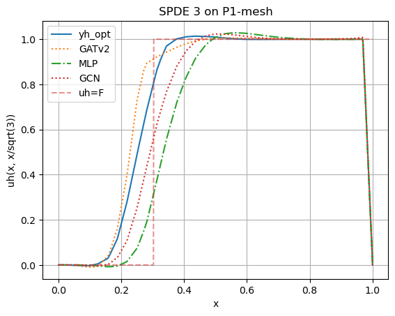

# Results and research path

This page is the shortest route through the scientific work. It connects the
initial heterogeneous study in Chapter 4 with the revised AFC-BJK study in
Chapter 5, while keeping the raw submitted notebooks available for audit.

## The question

The project asks whether a model can predict one SUPG stabilization parameter
per mesh cell from local finite-element data, and whether graph message passing
helps when the useful information is not purely local. Every prediction is
judged twice: first as a parameter field, then through the PDE solution it
produces.

## Submitted thesis: the experiment in one view

| Stage | What was done | What was learned |
| --- | --- | --- |
| Direct optimization | Cellwise parameters were optimized with L-BFGS-B and a discrete-adjoint gradient. | Targets were expensive: one reported case took about 12,000 iterations, and some triangular cases had not converged after more than one million. |
| Dataset | Seven benchmark families, triangular and quadrilateral meshes, 88 training cases and 14 test cases. | The dataset deliberately mixed objectives, element types, and aspect ratios. |
| Architecture search | MLP, GCN, GraphSAGE, GAT, and GATv2 used a common 10-layer, width-5 design after experiments with a 64-32-32 design. | Larger layers were not automatically better; the chosen small architecture exposed differences between aggregation rules. |
| Supervised comparison | The models fitted directly optimized parameter fields. | In the simpler Chapter 4 setup, supervised training did not produce satisfactory results consistently. |
| FEM-backed comparison | The same architectures were trained directly on the FEM objective via the adjoint bridge. | MLP produced the best individual results but also more unusable cases; GATv2 produced fewer unusable cases and generalized best. |
| Revised study | Chapter 5 introduced an AFC-BJK reference, interior-cell models, wider networks, and a revised optimization loop. | Revised GATv2 outperformed revised MLP in both target fit and AFC-BJK solution loss, although both retained outflow artifacts. |

The result below illustrates why parameter error is not enough. It compares a
directly optimized field with several learned predictions along the internal
layer in benchmark 3.

The Chapter 4 conclusion is deliberately qualified. Neighbour information can
help, and GATv2 had the best generalization, but the local MLP still produced
the best result on several individual problems. The heterogeneous 88-case
dataset, differing loss scales, and mesh variation prevented consistently
physical predictions.

## What the archive contributes

The submitted notebooks preserve evidence that a polished tutorial would
normally hide: long optimizer traces, failed architectures, one-off diagnostic
plots, and overwritten exploratory cells. The canonical notebooks retain the
experimental decisions and conclusions, while reusable FEM, graph, and
training machinery lives in `supgml`.

Use these pairs when auditing a result:

| Canonical account | Submitted evidence |
| --- | --- |
| Notebooks 01-02: objective and dataset | `archive/prototypes/analysis_optimal_parameters.ipynb`, `data_generation.ipynb` |
| Notebook 03: supervised comparison | `archive/chapter4/Train_*.ipynb` |
| Notebooks 04-05: FEM-backed training and evaluation | `archive/chapter4/*_self_supervised.ipynb`, `Test_set_analysis.ipynb` |

## Chapter 5: revised supervised approach

Notebooks 06-09 document the thesis revision. They use an AFC-BJK solution as a
stronger reference, examine target ambiguity, restrict prediction to interior
cells, increase model capacity, and compare revised MLP and GATv2 models.

The near-overlap in these line cuts is encouraging, but the perturbation study
shows that substantially different parameter fields can yield similarly small
solution losses. Revised GATv2 achieved a target distance of 0.4551 and an
AFC-BJK loss of $2.66\times10^{-6}$, compared with 0.9153 and
$9.643\times10^{-6}$ for revised MLP. Both predictions still showed unphysical
behaviour at the outflow boundary, so target fit, FEM loss, and solution shape
must be read together.

One small provenance discrepancy is kept explicit in notebook 07: thesis
Equation (28) prints an initial learning-rate factor of `0.01`, whereas both
submitted revised-training notebooks execute Adam with `lr=1e-3`. The canonical
configuration follows the executed code (`0.001`).

Continue with the [notebook map](notebooks.md), or open the
[rendered notebooks](rendered-notebooks.md) directly.
